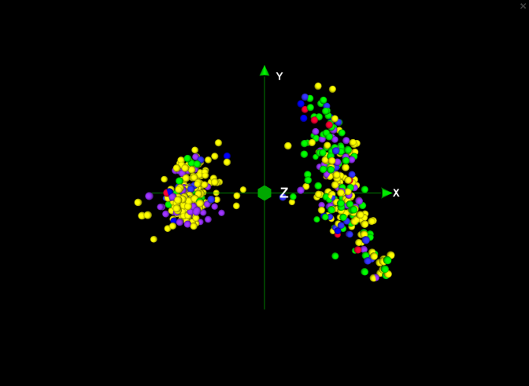
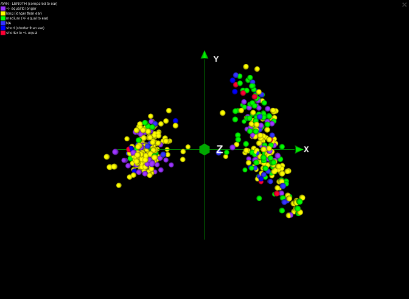
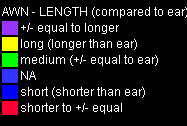

Capture Screenshot
==================

To take a screenshot of the scene in CurlyWhirly, click the Screenshot button which is found in the toolbar at the top of the screen. This should open the dialog seen below: 

.. image:: images/export-screenshot.png

The dialog presents three different screenshot options: 

Screenshot of the scene 
    Selecting this allows you to output a screenshot of the 3D plot exactly as you currently see it within CurlyWhirly. 

Screenshot of the scene with colour key 
    Selecting this allows you to output a screenshot of the 3D plot as above but with the addition of a colour key which is superimposed in the top left-hand corner of the screenshot. The colour key shows which Category is currently having its colours displayed, as well as specifying which colour represents which value for the category.

Standalone colour key 
    Allows you to output the same colour key as above but this time on its own without the screenshot of the plot. This can be handy if your view is zoomed in particularly close to the points and in the situation above the colour key may obscure some of the points. It may also be useful for displaying alongside movies of the 3D plot. 

CurlyWhirly automatically looks to save the file alongside the input file originally used to load the current data set and uses that file's name as the basis for its default name for screenshots. You can however either enter a filename directly into the text box, or browse for a new location and add a new name using the ``Browse...`` button. Finally to save the screenshot to disk click ``OK``, otherwise to cancel the operation click ``Cancel``. 