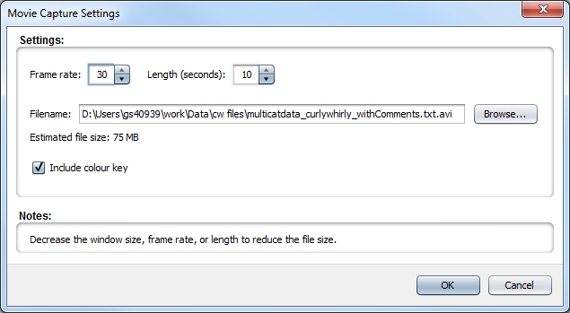

Capture Movie
=============
To take capture a movie of the 3D plot, click the Capture movie button on the toolbar at the top of CurlyWhirly's display. CurlyWhirly will fully rotate the scene once for the length of the movie specified within the dialog. This should open the dialog seen below: 

Settings
--------
Frame rate 
    The number of frames per second the movie will run at. In general a higher number will result in a smoother movie. The maximum allowed value is 60 frames per second as there is little benefit going beyond this number for typical PC monitors. 
Length (seconds) 
    The length in seconds of the movie to be captured. This is the length of time it will take CurlyWhirly to fully rotate the scene once. 
Filename 
    CurlyWhirly uses a default filename based on the name of the input file used to load the data set. You can use the Browse... button to specify a different location and name. 
Estimated file size 
    CurlyWhirly shows you an estimate of what the final file size of the movie will be once it is saved to disk. This is a function of the frame rate and the length, movies with higher frame rates that last longer will have a larger file size than those with lower frame rates which are shorter. 
Include colour key 
    You can include a colour key as part of the movie in much the same way as you can in a screenshot within CurlyWhirly. It appears superimposed on the top left-hand corner of the movie. If this will encroach on the data points in your display you can optionally output a standalone colour key from the Capture Screenshot dialog. 

Either click OK to start the movie capture process, or Cancel to return to the 3D plot. If you click OK you should see a dialog indicating the progress of the movie capture process. Once the process is complete you will be offered an option to open the movie for viewing, or to return to the 3D plot.