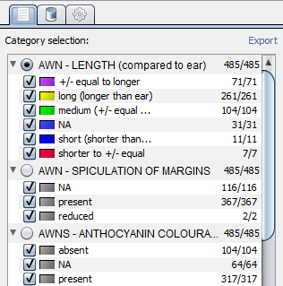

Category Selection
==================

Basics
------
You can select categories for your data set from selection tab within CurlyWhirly. To select a category click the radio button beside that category name. You should now see that the scene is using the colours specified by the values of your selected category. You can select category values which you do not wish to be coloured by clicking the check box next to a category value. Data points which have the category value which you don't want to colour by will appear as grey spheres. 

Hierarchical filtering
----------------------
While you only select one category for colouring by, you can filter which spheres are coloured by deselecting category values in any category. For example you could colour by AWN - LENGTH and filter the selection so that only the long (longer than ear) value was selected from that category, as well as only having the present value selected from the AWN - SPICULATION OF MARGINS category. Any data points which didn't shared that combination of selected category values would appear as grey spheres. You can either progressively filter down from the full set of points by removing categories you're not interested in, or you can use the Select none button at the bottom of the selection tab and progressively add categories to the set that you're interested in seeing. 

Category colours
----------------
You can change the colour of a category value by double clicking on the coloured rectangle which represents that value's colour. You should see a colour selection dialog from which you can select a new colour for the value. This colour is remembered for this category value within this dataset going forward. Additionally if you export this data set using the Export option from the toolbar these colours are exported along with the data. 