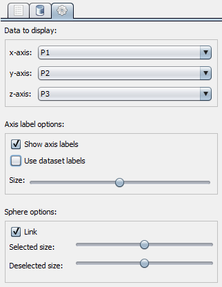
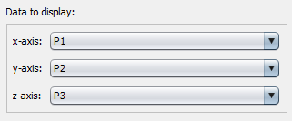
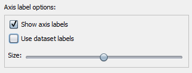
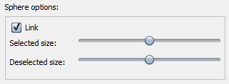

Controls Tab
============

The ``Controls Tab`` allows you to control several aspects of the way data is displayed within CurlyWhirly.

Data to display
---------------
You can select the coordinate from your data set which is displayed on each axis of the display. To select which coordinate is on - for example - the x-axis simply select a coordinate from the drop-down menu and that coordinate's value for each point will be used for the x-axis in the display. 

Axis label options
------------------
Show axis labels 
    Ticking this makes axis labels appear at the end of the positive extent of each axis. 
Use dataset labels 
    Ticking this changes the axis labels so that they use the names given to the coordinate bound to each axis found in the data file, rather than X, Y and Z. 
Size 
    Allows you to alter the size of the axis labels. 

Sphere options
--------------
Link 
    When you move either the Selected size or Deselected size sliders, the other slider will move by the same amount. This keeps the size of selected and deselected points the same as each other. 
Selected size 
    Allows you to change the size of data points which are selected (coloured) within the display. 
Deselected size 
    Allows you to change the size of data points which are deselected (not coloured) within the display. 

