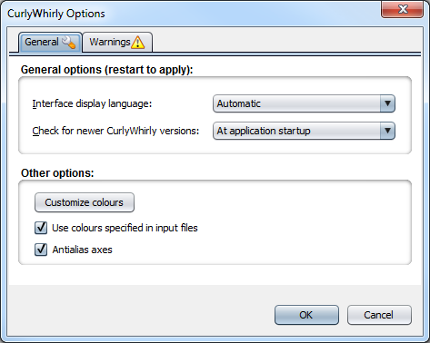
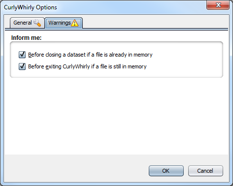

CurlyWhirly Options
===================

General
-------

General options
^^^^^^^^^^^^^^^

Interface display language 
    Allows you to choose the language of CurlyWhirly's user interface. Automatic uses you're operating system's language, other options allow you to pic specific languages (e.g. English (UK), English (US), German (DE) and Spanish (MX)). 
Check for newer CurlyWhirly versions 
    You can set when CurlyWhirly checks for updated version of itself. By default this option is set to At application startup, other values are Never, Once a day, Once a week and Once a month. 

Other options
^^^^^^^^^^^^^

Customize colours 
    Clicking this opens the Customize Colours dialog. This dialog is a listing of the default colours for each of the main components in CurlyWhirly (e.g. X-Axis). To change the colour for a component simply double click the colour, then pick a new colour from the colour picker dialog that is shown. This new colour will now be your new default for that component. 
Use colours specified in input files 
    When you export data from CurlyWhirly the exported data will include any colours associated with category values in that data set. Having this option ticked means any colours found in a file being imported will be used as the colours for category values in your CurlyWhirly. 
Antialias axes 
    Enabling this offers smoother axes at the cost of slightly reduced performance. 

Warnings
--------

Inform me
^^^^^^^^^

Before closing a dataset if a file is already in memory 
    With this checked CurlyWhirly will ask if you're sure you want to close the data set when you attempt to close it using the X in the top right hand corner of the 3D plot. 
Before exiting CurlyWhirly if a file is still in memory 
    With this checked CurlyWhirly will ask if you're sure you want to close the application while you are viewing a 3D plot. 